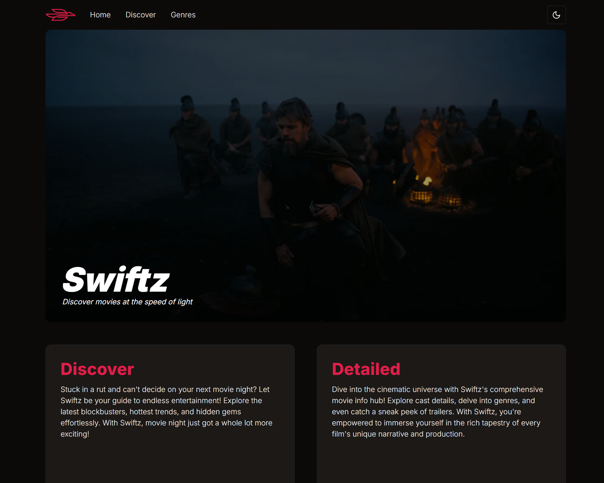
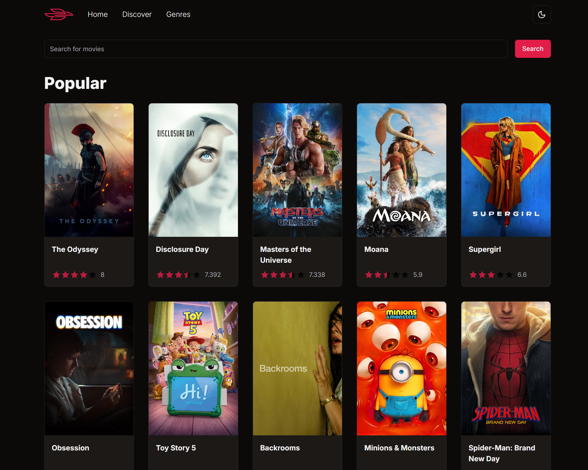
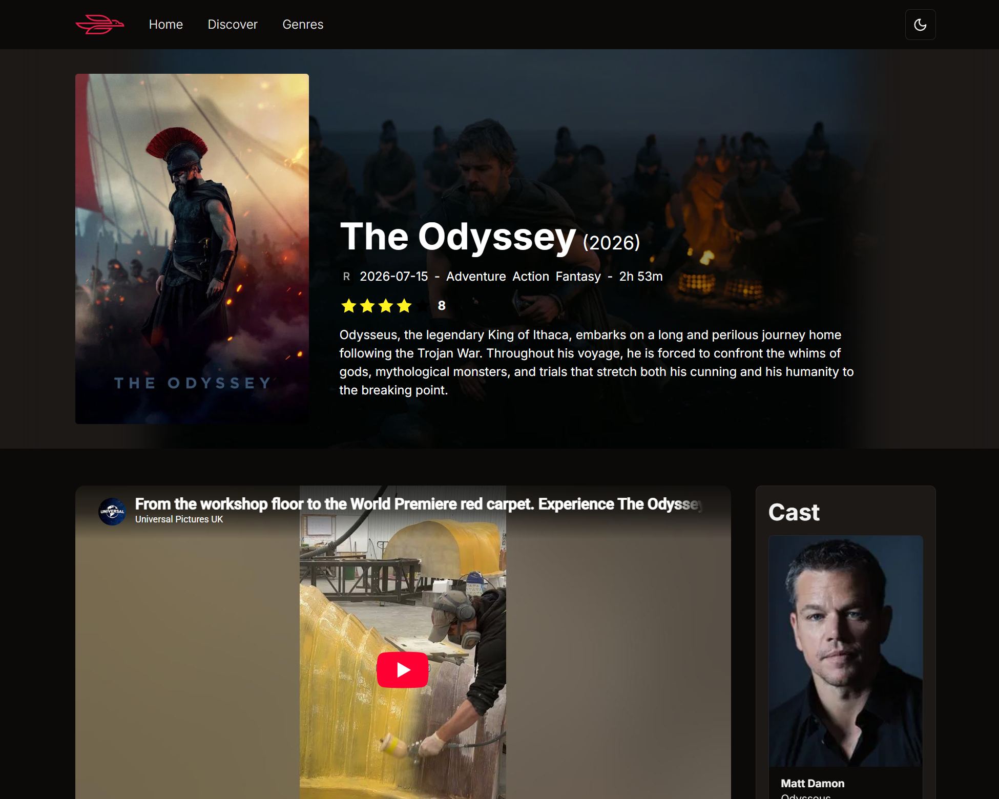
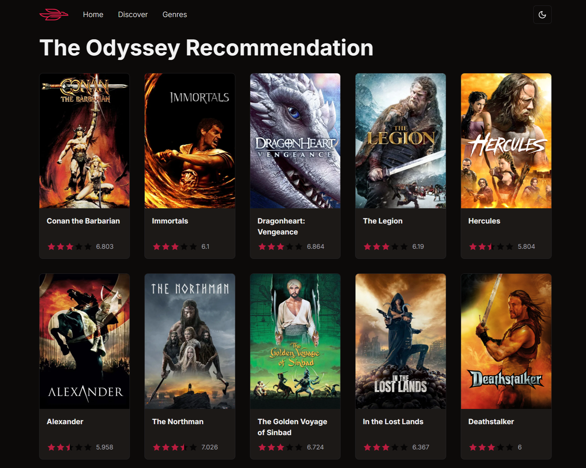

  
  <h1>Swiftz</h1>
  

    Swiftz is a modern, sleek web application for movie discovery that combines a stunning UI with powerful features for a deeply immersive and smooth browsing experience.
  

## Screenshots

  
  
  
  

## Features

- **Movie Discovery:** Explore diverse catalogs featuring trending, popular, and highly-rated movies. Find your next favorite film effortlessly.
- **Detailed Movie Insights:** Dive deep into detailed movie profiles, complete with high-quality hero backdrops, comprehensive cast lists, and star ratings.
- **Video Trailers:** Watch movie trailers directly within the app without breaking yk

## Tech Stack

- **Framework:** [Next.js 14](https://nextjs.org/) & [React 18](https://react.dev/)
- **Styling:** [Tailwind CSS](https://tailwindcss.com/)
- **UI Components:** [Shadcn](https://ui.shadcn.com/)
- **Icons:** [Lucide React](https://lucide.dev/)
- **Data Fetching:** [Axios](https://axios-http.com/)
- **Forms:** [React Hook Form](https://react-hook-form.com/)
- **Animations & Colors:** `tailwindcss-animate`, `fast-average-color`